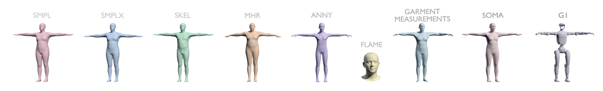

# body-models

A unified library for parametric human body models.

Provides a shared interface across SMPL, SMPL-X, SKEL, FLAME, ANNY, MHR, and SOMA body models with PyTorch, NumPy, and JAX backends.

## Features

- **Multi-backend**: PyTorch, NumPy, and JAX
- **Disentangled outputs**: separate `forward_vertices` (mesh) and `forward_skeleton` (joint transforms)
- **Mesh simplification**: lower-resolution forward pass via `simplify` constructor argument
- **Vertex subsets**: compute only specific vertices via `vertex_indices` argument
- **Rotation representations**: axis-angle, quaternion, 6D, rotation matrix, and projected matrix (`rotation_type` constructor argument)

## Installation

```bash
pip install body-models
```

Or with uv:

```bash
uv add body-models
```

### Optional backends

PyTorch and JAX are optional dependencies. Install them for the corresponding backends:

```bash
# For PyTorch backend
pip install body-models[torch]

# For JAX backend
pip install body-models[jax]
```

Note: NumPy/JAX backends can load MHR torch checkpoints without installing PyTorch.

## Model Setup

### Auto-download models

ANNY, MHR, and SOMA models are automatically downloaded on first use:

```python
from body_models.anny.torch import ANNY
from body_models.mhr.torch import MHR
from body_models.soma.torch import SOMA

model = ANNY()  # Downloads automatically (CC0 license)
model = MHR()   # Downloads automatically (Apache 2.0)
model = SOMA()  # Downloads SOMA_neutral.npz from SOMA-X
```

You can also prefetch them and save the cache paths into config:

```bash
body-models download anny
body-models download mhr
body-models download soma
```

SOMA is implemented natively in `body-models`; it does not require installing `py-soma-x`.

### Registration-required models

SMPL, SMPL-X, SKEL, and FLAME require registration. Download from:
- SMPL: https://smpl.is.tue.mpg.de/
- SMPL-X: https://smpl-x.is.tue.mpg.de/
- SKEL: https://skel.is.tue.mpg.de/
- FLAME: https://flame.is.tue.mpg.de/

You can let the CLI download all supported models into the platform cache and save those paths into config:

```bash
body-models download anny
body-models download mhr
body-models download soma
body-models download smpl
body-models download smplx
body-models download skel
body-models download flame
body-models download all
```

Or set credentials via environment variables first:

```bash
SMPL_USERNAME=you@example.com SMPL_PASSWORD=... body-models download smpl
SMPLX_USERNAME=you@example.com SMPLX_PASSWORD=... body-models download smplx
SKEL_USERNAME=you@example.com SKEL_PASSWORD=... body-models download skel
FLAME_USERNAME=you@example.com FLAME_PASSWORD=... body-models download flame
```

SMPL `.pkl` and `.npz` files are both supported directly. You can also configure paths manually (per gender):

```bash
body-models set smpl-neutral /path/to/SMPL_NEUTRAL.pkl
body-models set smpl-male /path/to/SMPL_MALE.pkl
body-models set smpl-female /path/to/SMPL_FEMALE.pkl
body-models set smplx-neutral /path/to/SMPLX_NEUTRAL.npz
body-models set skel /path/to/skel
body-models set flame /path/to/flame
body-models set soma /path/to/soma-assets
```

Or pass file paths directly:

```python
from body_models.smpl.torch import SMPL

# Direct file path (no gender needed)
model = SMPL(model_path="/path/to/SMPL_NEUTRAL.pkl")

# From config using gender
model = SMPL(gender="neutral")  # Uses smpl-neutral config key
```

### Configuration

View current settings:

```bash
$ body-models
Config file: /path/to/config.toml  # Platform-dependent location

Current settings:
  smpl-male: /data/models/smpl/SMPL_MALE.pkl
  smpl-female: /data/models/smpl/SMPL_FEMALE.pkl
  smpl-neutral: /data/models/smpl/SMPL_NEUTRAL.pkl
  smplx-male: (not set)
  smplx-female: (not set)
  smplx-neutral: (not set)
  skel: (not set)
  flame: (not set)
  anny: (not set)
  mhr: (not set)
  soma: (not set)
```

Manage paths:

```bash
body-models set <model> <path>   # Set model path
body-models unset <model>        # Remove from config
body-models download <model>     # Download anny, mhr, soma, smpl, smplx, skel, flame, or all
```

## Quick Start

```python
# Import from specific backend (torch, numpy, or jax)
from body_models.smplx.torch import SMPLX

# Load model from config
model = SMPLX(gender="neutral")  # Uses smplx-neutral config key

# Or load from direct file path
model = SMPLX(model_path="/path/to/SMPLX_NEUTRAL.npz")

# Get default parameters
params = model.get_rest_pose(batch_size=4)

# Generate mesh vertices
vertices = model.forward_vertices(**params)  # [4, V, 3]

# Get skeleton transforms
skeleton = model.forward_skeleton(**params)  # [4, J, 4, 4]
```

Available backends:
- `body_models.<model>.torch` - PyTorch (differentiable)
- `body_models.<model>.numpy` - NumPy
- `body_models.<model>.jax` - JAX/Flax (differentiable)

## Common Interface

All models inherit from `BodyModel` and share these properties:

| Property | Type | Description |
|----------|------|-------------|
| `num_joints` | `int` | Number of skeleton joints |
| `num_vertices` | `int` | Number of mesh vertices |
| `joint_names` | `list[str]` | Joint names |
| `faces` | `[F, 3]` | Mesh face indices |
| `skin_weights` | `[V, J]` | Skinning weights |
| `rest_vertices` | `[V, 3]` | Vertices in rest pose |

### Common Methods

```python
# Get zero-initialized parameters (model-specific keys)
params = model.get_rest_pose(batch_size=1)

# Compute mesh vertices [B, V, 3] in meters
vertices = model.forward_vertices(**params)

# Compute joint transforms [B, J, 4, 4] in meters
transforms = model.forward_skeleton(**params)
```

### Mesh Simplification

All models support mesh simplification via the `simplify` constructor argument:

```python
# Reduce face count by half (2x simplification)
model = SMPL(gender="neutral", simplify=2.0)

# Reduce to ~1/4 of original faces
model = SMPLX(gender="neutral", simplify=4.0)
```

The `simplify` parameter is a divisor for the face count. Default is `1.0` (no simplification). Skinning weights and blend shapes are automatically mapped to the simplified mesh.

### Vertex Subsets

All mesh-based models support computing only specific vertices:

```python
# Only compute vertices 0, 100, 200
vertices = model.forward_vertices(**params, vertex_indices=[0, 100, 200])
# Returns [B, 3, 3] instead of [B, V, 3]
```

This avoids computing the full mesh when you only need a few vertices (e.g. for landmark loss).

### Rotation Representations

SMPL, SMPL-X, FLAME, and ANNY support multiple rotation representations via the `rotation_type` constructor argument:

```python
model = SMPL(gender="neutral", rotation_type="sixd")  # Use 6D rotations
```

Supported types:
| Type | Shape per joint | Description |
|------|----------------|-------------|
| `"axis_angle"` | `[3]` | Axis-angle (default) |
| `"quat"` | `[4]` | Quaternion (wxyz convention) |
| `"sixd"` | `[6]` | 6D continuous representation |
| `"rotmat"` | `[3, 3]` | Rotation matrix (assumed SO(3)) |
| `"matrix"` | `[3, 3]` | General 3x3 matrix (SVD-projected to SO(3)) |

The `"matrix"` type is useful when optimizing rotations without constraints -- inputs are projected to the nearest valid rotation matrix via SVD. The `"rotmat"` type assumes inputs are already valid rotation matrices and skips the projection.

## Supported Models

### SMPL

The original parametric body model with 6890 vertices and 24 joints.

```python
from body_models.smpl.torch import SMPL  # or .numpy, .jax

model = SMPL(gender="neutral")  # "neutral", "male", or "female"

vertices = model.forward_vertices(
    shape,               # [B, 10] body shape betas
    body_pose,           # [B, 23, 3] axis-angle per joint
    pelvis_rotation,     # [B, 3] root joint rotation (optional)
    global_rotation,     # [B, 3] post-transform rotation (optional)
    global_translation,  # [B, 3] translation (optional)
)
```

Conversion functions for working with the official smplx library format:

```python
from body_models import smpl

# Convert flat tensors to API format
args = smpl.from_native_args(shape, body_pose, pelvis_rotation, global_translation)
vertices = model.forward_vertices(**args)
transforms = model.forward_skeleton(**args)

# Convert outputs back to native format
result = smpl.to_native_outputs(vertices, transforms)
```

### SMPL-X

Expressive body model with articulated hands and facial expressions.

```python
from body_models.smplx.torch import SMPLX  # or .numpy, .jax

model = SMPLX(
    gender="neutral",     # "neutral", "male", or "female"
    flat_hand_mean=False, # Flat hands as mean pose
)

vertices = model.forward_vertices(
    shape,               # [B, 10] body shape betas
    body_pose,           # [B, 21, 3] axis-angle per body joint
    hand_pose,           # [B, 30, 3] axis-angle (left 15 + right 15)
    head_pose,           # [B, 3, 3] jaw + left eye + right eye
    expression,          # [B, 10] facial expression (optional)
    pelvis_rotation,     # [B, 3] root joint rotation (optional)
    global_rotation,     # [B, 3] post-transform rotation (optional)
    global_translation,  # [B, 3] translation (optional)
)
```

Conversion functions for working with the official smplx library format:

```python
from body_models import smplx

# Convert flat tensors to API format
args = smplx.from_native_args(shape, expression, body_pose, hand_pose, head_pose,
                              pelvis_rotation, global_translation)
vertices = model.forward_vertices(**args)
transforms = model.forward_skeleton(**args)

# Convert outputs back to native format
result = smplx.to_native_outputs(vertices, transforms)
```

### SKEL

Anatomically realistic skeletal articulation based on OpenSim. Only "male" and "female" genders are supported (no "neutral").

```python
from body_models.skel.torch import SKEL  # or .numpy, .jax

model = SKEL(gender="male")  # "male" or "female" (no neutral)

vertices = model.forward_vertices(
    shape,               # [B, 10] body shape betas
    pose,                # [B, 46] anatomically constrained DOFs
    global_rotation,     # [B, 3] axis-angle (optional)
    global_translation,  # [B, 3] (optional)
)
```

### FLAME

FLAME (Faces Learned with an Articulated Model and Expressions) head model.

```python
from body_models.flame.torch import FLAME  # or .numpy, .jax

model = FLAME()  # Uses configured path

vertices = model.forward_vertices(
    shape,               # [B, 300] shape betas (can use fewer)
    expression,          # [B, 100] expression coefficients (optional)
    pose,                # [B, 4, 3] axis-angle for neck, jaw, left_eye, right_eye (optional)
    head_rotation,       # [B, 3] root joint rotation (optional)
    global_rotation,     # [B, 3] post-transform rotation (optional)
    global_translation,  # [B, 3] translation (optional)
)
```

Conversion functions for working with the official FLAME/smplx library format:

```python
from body_models import flame

# Convert native args to API format
args = flame.from_native_args(shape, expression, pose, head_rotation, global_rotation, global_translation)
vertices = model.forward_vertices(**args)
transforms = model.forward_skeleton(**args)

# Convert outputs back to native format
result = flame.to_native_outputs(vertices, transforms)
```

### ANNY

Phenotype-based body model with intuitive shape parameters.

```python
from body_models.anny.torch import ANNY  # or .numpy, .jax

model = ANNY(
    rig="default",                # "default", "default_no_toes", "cmu_mb", "game_engine", "mixamo"
    topology="default",           # "default" or "makehuman"
    all_phenotypes=False,         # Include race/cupsize/firmness
    extrapolate_phenotypes=False, # Allow values outside [0, 1]
)

vertices = model.forward_vertices(
    gender,              # [B] in [0, 1] (0=male, 1=female)
    age,                 # [B] in [0, 1]
    muscle,              # [B] in [0, 1]
    weight,              # [B] in [0, 1]
    height,              # [B] in [0, 1]
    proportions,         # [B] in [0, 1]
    pose,                # [B, J, 3] axis-angle per joint
    global_rotation,     # [B, 3] axis-angle (optional)
    global_translation,  # [B, 3] (optional)
)
```

### MHR

Meta Human Renderer with neural pose correctives.

```python
from body_models.mhr.torch import MHR  # or .numpy, .jax

model = MHR(lod=1)  # Level of detail

vertices = model.forward_vertices(
    shape,               # [B, 45] identity blendshapes
    pose,                # [B, 204] pose parameters
    expression,          # [B, 72] facial expression (optional)
    global_rotation,     # [B, 3] axis-angle (optional)
    global_translation,  # [B, 3] (optional)
)
```

Conversion functions for working with the original MHR format (cm units):

```python
from body_models import mhr

# Convert native args (shape, expression, pose order) to API format
args = mhr.from_native_args(shape, expression, pose)
vertices = model.forward_vertices(**args)
transforms = model.forward_skeleton(**args)

# Convert outputs to native format (cm units, skeleton state [t, q, s])
result = mhr.to_native_outputs(vertices, transforms)
```

## Coordinate System

The unified API returns outputs in:
- **Y-up** coordinate system
- **Meters** as the unit

Use the `to_native_outputs()` conversion functions to get outputs in the original library conventions.

## Development

```bash
uvx ruff format .   # Format code
uvx ruff check .    # Lint
uvx ty check        # Type check
```

## License

See individual model licenses for usage terms:
- SMPL: https://smpl.is.tue.mpg.de/
- SMPL-X: https://smpl-x.is.tue.mpg.de/
- SKEL: https://skel.is.tue.mpg.de/
- FLAME: https://flame.is.tue.mpg.de/
- ANNY: CC0 (MakeHuman data)
- MHR: Apache 2.0 (Meta Platforms, Inc.)
