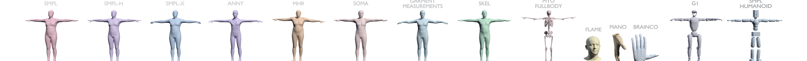

# body-models

`body-models` provides a shared interface for parametric human body, head, hand,
anatomical, measurement, and robot models with NumPy, PyTorch, and JAX runtimes.

Documentation: https://abcamiletto.github.io/body-models/

## Features

- NumPy, PyTorch, and JAX runtimes
- Optional Warp acceleration for Torch skinning
- Static pose-corrective joint subsets for SMPL-family quality/performance LODs
- Separate mesh and skeleton forwards with `forward_vertices()` and `forward_skeleton()`
- Prepared identities for repeated poses with fixed shape/expression parameters
- Mesh simplification and vertex-subset forwards for supported mesh models
- Multiple rotation representations for supported pose models

## Install

```bash
uv add body-models
```

Install optional extras when needed:

```bash
uv add "body-models[torch]"
uv add "body-models[jax]"
uv add "body-models[torch,warp]"
```

Public model assets download on first use into the operating system's private
user cache. Licensed assets use `body-models download MODEL`, which prompts for
credentials. Use `body-models download MODEL --output-dir PATH` when assets
should live in a specific directory; run `body-models` to inspect the cache and
configured paths.

## Quick Start

```python
from body_models.smpl.torch import SMPL

model = SMPL(gender="neutral")
params = model.get_rest_pose(batch_dims=(1,))

vertices = model.forward_vertices(**params)
skeleton = model.forward_skeleton(**params)
```

Every model exposes a machine-readable description of those parameters:

```python
model.parameter_spec
# {
#     "shape": ParameterSpec(shape=(10,), role="identity", ...),
#     "body_pose": ParameterSpec(shape=(23, 3), role="pose", rotation_type="axis_angle", ...),
#     ...
# }
```

Each entry reports the unbatched array shape, semantic role, numeric default,
and rotation representation when applicable. A rotation representation implies
the corresponding identity rotation. `get_rest_pose()` constructs its arrays
directly from this specification.

Select NumPy, Torch, or JAX in the import path. Torch models expose their
skinning implementation directly:

```python
from body_models.smpl.torch import SMPL

model = SMPL(gender="neutral", skinning_backend="warp")
model = model.cuda()
```

Models imported from a `torch` module are `torch.nn.Module` instances, so
`.to()`, `.cuda()`, and `state_dict()` work directly.

The equivalent NumPy and JAX classes live in `body_models.smpl.numpy` and
`body_models.smpl.jax`. Discover available model names with
`body_models.list_models()`. The `create_model()` factory remains available
when the model and runtime must be selected dynamically.

## Public API

The stable API consists of names exported from `body_models` and each model
backend package. For example, `body_models.smpl.torch.SMPL` is public;
underscore-prefixed modules such as `body_models.smpl._model` are
implementation details and are not covered by semantic-versioning
compatibility guarantees. Every model
derives from `body_models.ArticulatedModel`. Skinned model packages also export
model-specific prepared-state types when their schema is unique. Shared linear
models use `body_models.LinearIdentity` and `body_models.SkinningPose`.
Required numerical inputs may be positional; optional model arguments are
keyword-only.

The shared metadata API exposes `joint_names`, `parents`, `num_joints`,
`common_joints`, `has_hands`, and `has_face`. Fixed model dimensions use
`NUM_*` class constants such as `NUM_BODY_JOINTS`, `NUM_SHAPE_COEFFS`, and
`NUM_BODY_POSE_COEFFS`; a model defines only the dimensions that are meaningful
for that model. Dimensions selected by a constructor option remain instance
properties, such as SOMA's `num_shape_coeffs`.

When shape-dependent identity parameters stay fixed across many poses, prepare
them once and pass the returned dictionary back through `identity`. This avoids
recomputing rest joints, local offsets, and rest vertices on every forward pass.

```python
shape = params.pop("shape")
identity = model.prepare_identity(shape)

vertices = model.forward_vertices(**params, identity=identity)
skeleton = model.forward_skeleton(**params, identity=identity)
```

For models with expression-dependent rest state, such as SMPL-X and FLAME, pass
both identity controls to `prepare_identity(shape, expression)`. Prepared
identities and poses on skinned models are always complete mesh-ready values;
skeleton forwards use separate lightweight internal preparation and never
return partial state.

## Supported Models

- Full bodies: SMPL, SMPL-H, SMPL-X, ANNY, MHR, SOMA, GarmentMeasurements
- Anatomicals: SKEL, MyoFullBody
- Heads: FLAME
- Hands: MANO
- Robots and humanoids: BrainCo, G1, SmplHumanoid

See the [model docs](https://abcamiletto.github.io/body-models/#supported-models)
for setup, supported runtimes, inputs, and model-specific behavior.
The [architecture guide](https://abcamiletto.github.io/body-models/architecture/)
describes the model, runtime, and shared-operation boundaries.

## Development

```bash
uv run ruff format .
uv run ruff check .
uv run ty check
```

## License

See the documentation and upstream model projects for model-specific license
terms.
